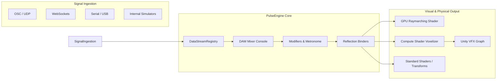

# About PulseEngine

Welcome to the **PulseEngine** documentation.

**PulseEngine** is a high-performance Unity package designed for real-time signal routing, virtual DAW console mixing, and procedural volumetric rendering. It couples multi-protocol continuous telemetry (biometric sensors, audio streams, IoT, motion tracking, network sockets) directly to procedural geometry (**Signed Distance Fields - SDFs**) and massive GPU particle swarms (**Unity VFX Graph**).

Originally engineered for clinical trauma biofeedback in Extended Reality (XR) at the **Politecnico di Torino**, PulseEngine is built from the ground up to be **domain-agnostic**, making it equally powerful for medical simulation, audio-reactive VJ stages, interactive installations, and game development.

---

## Core Architectural Pillars

### 1. High-Performance Virtual DAW Mixer
* **Hardware-Style Console (`DAWMixerWindow`)**: Direct visual mixing with vertical channel strips, interactive faders, hardware OLED oscilloscopes, VU meters, and engine-level Mute/Solo.
* **Zero-GC Runtime Dispatcher**: Thread-safe, non-allocating signal bus (`DataStreamRegistry`) running at full target framerate (72/90/120 Hz).
* **Automatic Signal Discovery**: Inbound signal sniffer that inspects incoming telemetry, detects unknown packets, and provisions calibrated channels automatically.
* **Network Anti-Jitter Metronome**: Converts clustered, irregular network data packets into smooth rhythmic triggers with continuous mathematical phase integration.

### 2. Procedural Volumetric Engine (SDF & GPU Voxelizer)
* **Real-Time URP Raymarching**: CSG solid geometry evaluation (Sphere, Box, Torus, Cylinder, Capsule) with order-independent *Smooth Union*, *Smooth Subtraction*, and *Smooth Intersection*.
* **Standalone Modifier Volumes**: Localized domain warping (Twist, Bend, 3D Noise) with falloff gizmos, operating like spatial force fields on any intersecting geometry.
* **GPU 3D Texture Voxelizer**: Asynchronous Compute Shader pipeline generating dynamic `RGBAHalf` distance/color textures dispatched directly to Unity VFX Graph.
* **Fill-Rate Decoupling ("Physics-Only Mode")**: Completely disables costly solid fragment raymarching on mobile XR headsets (such as Meta Quest 3), retaining 100% volumetric particle physics collision at zero pixel-fill overhead.

---

## Technical Specifications & Requirements

| Specification | Supported / Verified Requirement |
| :--- | :--- |
| **Unity Version** | Unity 6 (6000.0+) LTS recommended |
| **Render Pipeline** | Universal Render Pipeline (URP) 17.0+ |
| **VFX Engine** | Unity Visual Effect Graph (VFX Graph) 17.0+ |
| **Input System** | Unity New Input System (`UnityEngine.InputSystem`) |
| **Tested Platforms** | Meta Quest 3 (Standalone Android OpenXR), PCVR, Windows Standalone |
| **Target Framerate** | 72 Hz / 90 Hz / 120 Hz with 0 Bytes runtime GC allocation |

---

## Document Navigation Guide

* [Installation & Setup](installation-and-setup.md): Package installation steps, project validation, and URP configuration.
* [Getting Started](getting-started.md): 5-minute quickstart from a raw wave generator to dynamic procedural geometry.
* **Signal Routing Manual**:
  * [Architecture & Data Pipeline](manual/signal-routing/architecture.md)
  * [DAW Mixer Console Manual](manual/signal-routing/daw-mixer.md)
  * [Multi-Protocol Ingestion](manual/signal-routing/multi-protocol-sources.md)
  * [Modifiers & Metronome](manual/signal-routing/modifiers-and-metronome.md)
  * [Property & Color Binders](manual/signal-routing/binders.md)
* **Volumetric SDF Engine Manual**:
  * [Primitives & CSG Operations](manual/volumetric-sdf/primitives-and-csg.md)
  * [Modifier Volumes](manual/volumetric-sdf/modifier-volumes.md)
  * [GPU Voxelizer & VFX Graph Pipeline](manual/volumetric-sdf/gpu-voxelizer-vfx.md)
  * [Triplanar Texturing & MatCaps](manual/volumetric-sdf/surface-texturing.md)
* **Clinical Biofeedback Suite**:
  * [Medical XR Bio-Feedback Suite](manual/clinical-biofeedback/biofeedback-suite.md)
* **Performance & Optimization**:
  * [Quest 3 Benchmarking & Profiling](manual/benchmarks/quest3-profiling.md)
