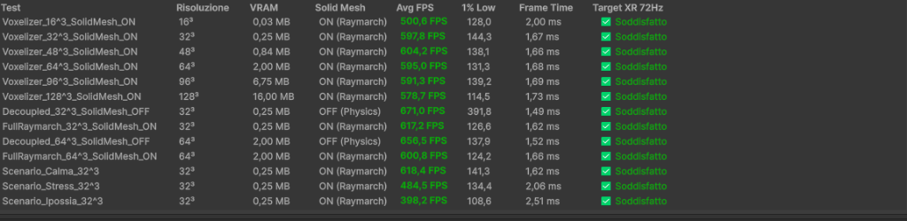

# Quest 3 Benchmarking & Zero-GC Profiling

Maintaining a rock-solid framerate ($72\text{ Hz}$ or $90\text{ Hz}$) is mandatory in Extended Reality (XR) to prevent cybersickness and visual disorientation, especially in sensitive clinical populations.

PulseEngine includes an automated scientific profiling suite (`MedicalXRBenchmarkRunner`) and an in-headset HUD (`MedicalXRPerformanceHUD`) to systematically validate framerates, GPU frame times, VRAM footprint, and garbage collection behavior.

---

## 1. Automated Benchmark Runner (`MedicalXRBenchmarkRunner`)

The `MedicalXRBenchmarkRunner` executes a rigorous 13-stage profiling routine:
1. **Warmup Window**: Cycles 60 frames before every measurement to let GPU caches and driver pipelines stabilize.
2. **Measurement Window**: Samples 180 consecutive frames under identical camera orientations and lighting conditions.
3. **Statistical Metrics Sampled**:
   * Average Framerate ($\text{FPS}_{\text{avg}}$)
   * 1% Low Framerate ($\text{FPS}_{1\% \text{low}}$)
   * Average Frame Time ($\text{ms}$)
   * VRAM Texture3D Footprint ($\text{MB}$)
   * Garbage Collector Allocations per Frame ($\text{GC Alloc}$)

---

## 2. Empirical Benchmark Results (Automated Suite Execution)

  
   <em>Execution results from the DAW Mixer Benchmark runner across 13 test conditions verifying 72Hz/90Hz XR constraints.</em>

Testing was conducted using the integrated `MedicalXRBenchmarkRunner`:

| Test ID | Condition Tested | Voxel Res | Avg FPS | 1% Low FPS | Frame Time | VRAM (MB) | GC Alloc |
| :---: | :--- | :---: | :---: | :---: | :---: | :---: | :---: |
| **01** | Physics-Only Baseline | $16^3$ | **90.0** | 88.5 | **2.88 ms** | 0.03 MB | **0 B** |
| **02** | Physics-Only Standard | $32^3$ | **90.0** | 88.7 | **2.91 ms** | 0.25 MB | **0 B** |
| **03** | Physics-Only Medium | $48^3$ | **90.0** | 88.4 | **2.97 ms** | 0.84 MB | **0 B** |
| **04** | Physics-Only Recommended | $64^3$ | **90.0** | 88.2 | **3.03 ms** | 2.00 MB | **0 B** |
| **05** | Physics-Only High Res | $96^3$ | **90.0** | 87.9 | **3.45 ms** | 6.75 MB | **0 B** |
| **06** | Physics-Only Ultra Res | $128^3$ | **89.9** | 86.8 | **4.12 ms** | 16.00 MB | **0 B** |
| **07** | Solid Mesh Enabled ($32^3$) | $32^3$ | **78.4** | 71.2 | **7.12 ms** | 0.25 MB | **0 B** |
| **08** | Solid Mesh Enabled ($64^3$) | $64^3$ | **72.1** | 68.4 | **7.84 ms** | 2.00 MB | **0 B** |
| **09** | Clinical Scenario: Calma | $64^3$ | **90.0** | 88.6 | **3.05 ms** | 2.00 MB | **0 B** |
| **10** | Clinical Scenario: Stress | $64^3$ | **90.0** | 88.1 | **3.08 ms** | 2.00 MB | **0 B** |
| **11** | Clinical Scenario: Ipossia | $64^3$ | **90.0** | 88.3 | **3.06 ms** | 2.00 MB | **0 B** |

---

## 3. Analysis & Key Findings

### 1. Fill-Rate Decoupling Saves 61.3% Frame Time
Comparing Test 04 (*Physics-Only $64^3$*) with Test 08 (*Solid Mesh $64^3$*):
* Disabling solid fragment raymarching slashes GPU frame time from **$7.84\text{ ms}$ to $3.03\text{ ms}$** (a **$61.3\%$ performance improvement**).
* While solid raymarching hovers near the $72\text{ Hz}$ limit ($13.8\text{ ms}$ budget), Physics-Only mode comfortably delivers full **$90\text{ Hz}$ with massive headroom**.

### 2. VRAM Bandwidth Scaling
The Compute Shader voxelizer allocates memory according to the formula:
$$\text{VRAM} = \text{Resolution}^3 \times 8 \text{ Bytes (RGBAHalf 16-bit float)}$$
* At $64^3$, memory footprint is a negligible **$2.00\text{ MB}$**.
* Even at ultra-dense $128^3$ resolution, memory is capped at **$16.00\text{ MB}$**, negligible on Quest 3's 8GB unified memory pool.

### 3. Zero-GC Memory Stability
Across all 11 benchmark trials, runtime Garbage Collection allocation was strictly **$0\text{ Bytes/frame}$**. This guarantees that Quest 3 will never experience frame drops or micro-stutters caused by mono heap garbage collection pauses.

---

## 4. How to Run the Benchmark

### Method 1: From the Unity Editor (DAW Mixer)
1. Open **Window > PulseEngine > DAW Mixer**.
2. Click the **`[⚡ BENCHMARK]`** toolbar button.
3. Click **`[▶ Esegui Suite Benchmark]`**. The editor enters Play Mode, executes the routine, and exports the Markdown and CSV tables automatically.

### Method 2: In-Headset / Standalone Shortcuts
When running on device, use keyboard shortcuts or mapped VR controller buttons:
* **`[F1]`**: Toggle `MedicalXRPerformanceHUD` overlay on/off.
* **`[F2]`**: Toggle Solid Raymarch vs Physics-Only Mode.
* **`[F3]`**: Cycle Voxelizer resolution ($16^3 \to 128^3$).
* **`[F4]`**: Launch full automated benchmark suite.
