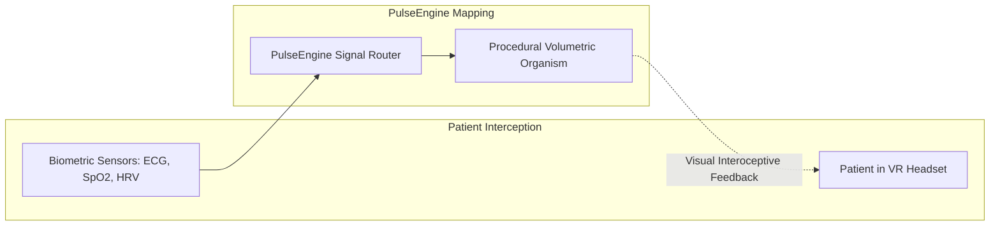
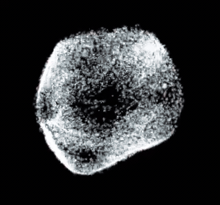
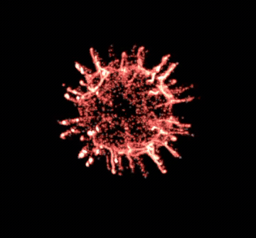
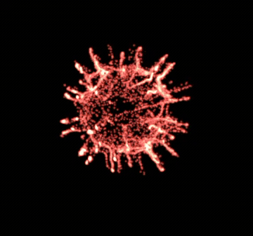

# Medical XR Bio-Feedback Suite (Clinical Flagship Sample)

The **Clinical Biofeedback Suite** is the flagship case study for PulseEngine. Developed in collaboration with a medical XR startup (**Lemons in the Room**) and the **Politecnico di Torino**, this module demonstrates how real-time physiological telemetry transforms into **visceral, perceptual feedback** to assist in autonomic nervous system regulation and trauma therapy.

---

## 1. Clinical Context & Rationale

Trauma therapy and somatic psychotherapy frequently struggle with patients' difficulty in perceiving their internal physiological state (**interoception**).

By translating invisible autonomic biosignals into an interactive, organic 3D organism in Extended Reality (XR), patients gain an intuitive external metaphor for their internal state:
* When the patient relaxes (activating parasympathetic vagal tone), the organism expands, softens, and harmonizes.
* When the patient enters stress or hyperarousal (sympathetic flight-or-fight), the organism contracts, hardens, and becomes turbulent.

---

## 2. Physiological Biomarkers & Visual Mappings

PulseEngine processes three primary clinical biomarkers:

### 1. Heart Rate (HR - Beats Per Minute)
* **Physiological Range**: $40\text{--}180\text{ BPM}$.
* **Visual Metaphor**: Drives the continuous pulsation frequency via `DataStreamMetronome`. Physical transform scale pulses outward on each R-wave contraction.

### 2. Autonomic Tone: Heart Rate Variability (HRV RMSSD)
* **Clinical Significance**: Root Mean Square of Successive Differences (RMSSD) is the gold-standard clinical metric for parasympathetic vagal activity. High RMSSD indicates stress resilience and calmness; suppressed RMSSD indicates acute anxiety or fight-or-flight arousal.
* **Visual Metaphor**: Mapped inversely to geometric tension and turbulence:
  * **High HRV (Calm)**: Increases `globalBlendSoftness` ($0.45\text{--}0.65$), melting shapes into smooth, flowing, spherical geometries.
  * **Low HRV (Stress)**: Reduces blend softness ($0.05\text{--}0.15$), contracting shapes into rigid, angular forms while amplifying high-frequency particle turbulence ($0.2 \to 2.5$).

### 3. Blood Oxygenation ($SpO_2$) & Perfusion Index (PI)
* **Clinical Significance**: Arterial blood oxygen saturation ($95\text{--}100\%$ normal, $< 90\%$ hypoxemic).
* **Visual Metaphor**: Mapped to chromatic shift via `DataStreamColorBinder`:
  * Normal ($98\%$): Radiant arterial scarlet and warm organic cellular tissue.
  * Hypoxic ($85\%$): Deep cyanotic indigo, desaturating particles and inducing surface domain contortion.

---

## 3. The Bouba-Kiki Affective Continuum & Clinical Demonstration

Grounded in cross-modal cognitive psychology (Köhler 1929, Ramachandran & Hubbard 2001) and Polyvagal Theory, PulseEngine frames the interoceptive biofeedback journey along the continuous **Bouba $\leftrightarrow$ Kiki** affective spectrum:

  
  
  
   <em>Real in-engine clinical capture: Left: <b>Bouba State</b> (parasympathetic calm, bulbous smooth lobes). Center: <b>Dynamic Morphing</b> (continuous real-time topological morphing). Right: <b>Kiki State</b> (sympathetic hyperarousal, acute star spikes and particle turbulence).</em>

PulseEngine translates autonomic tone across this continuum:

| Dimension / Parameter | 🟢 Bouba State (Parasympathetic / Low Arousal) | 🔄 Dynamic Transition Phase | 🔴 Kiki State (Sympathetic / High Arousal) |
| :--- | :---: | :---: | :---: |
| **Cognitive Affect** | Calming, soft, comforting, grounded | Organic morphological morphing | Alerting, urgent, high-tension, energetic |
| **Heart Rate (HR)** | $55\text{--}65\text{ BPM}$ (Resting baseline) | Smooth continuous acceleration | $120\text{--}150\text{ BPM}$ (Tachycardia / Flight-or-fight) |
| **Autonomic HRV (RMSSD)** | $65\text{--}90\text{ ms}$ (High vagal tone) | Adaptive hysteresis damping | $10\text{--}20\text{ ms}$ (Vagal withdrawal / Stress) |
| **Blood Oxygenation ($SpO_2$)** | $98\text{--}100\%$ (Optimal arterial perfusion) | Continuous dynamic gradient | $95\text{--}97\%$ (or hypoxic compensation) |
| **SDF Morphology** | Smooth rounded lobes, bulbous Euclidean SDF | Asymmetric exponential blending ($\tau = 2.5\text{s}$) | Acute star spires, high spatial frequency |
| **CSG Blend Softness ($k$)** | $0.45\text{--}0.65\text{ m}$ (Melting / Organic) | Modulated in real time by HRV | $0.05\text{--}0.12\text{ m}$ (Rigid / Spiky) |
| **VFX Particle Dynamics** | Gentle laminar adhesion, rhythmic pulsation | Directional velocity flow | Chaotic divergence, high turbulence curl |
| **Chromatic Emission** | Bioluminescent soft pastel glow | Harmonic transition | Saturated crimson / fire embers |

---

## 4. Clinical Safety & Perceptual Damping

> [!IMPORTANT]
> **Avoiding Jarring Transitions**: In somatic trauma therapy and clinical XR, abrupt visual jumps can trigger an adverse startle response.  
> PulseEngine enforces **asymmetric exponential damping** ($\tau \approx 2.5\text{ s}$) across the entire Bouba-Kiki continuum. When a patient recovers from acute stress (transitioning from Kiki back to Bouba), the spiky protrusions smoothly dissolve and melt into peaceful bulbous geometry over multiple respiratory cycles, reinforcing parasympathetic down-regulation.
