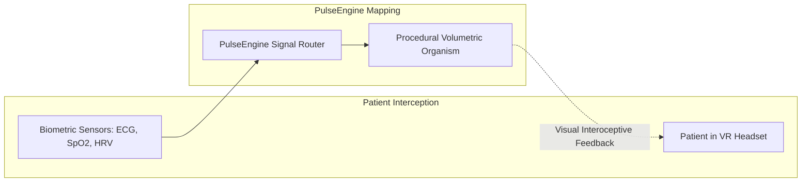

# Medical XR Bio-Feedback Suite (Clinical Flagship Sample)

The **Clinical Biofeedback Suite** is the flagship case study for PulseEngine. Developed in collaboration with a medical XR startup (**Lemons in the Room**) and the **Politecnico di Torino**, this module demonstrates how real-time physiological telemetry transforms into **visceral, perceptual feedback** to assist in autonomic nervous system regulation and trauma therapy.

---

## 1. Clinical Context & Rationale

Trauma therapy and somatic psychotherapy frequently struggle with patients' difficulty in perceiving their internal physiological state (**interoception**).

By translating invisible autonomic biosignals into an interactive, organic 3D organism in Extended Reality (XR), patients gain an intuitive external metaphor for their internal state:
* When the patient relaxes (activating parasympathetic vagal tone), the organism expands, softens, and harmonizes.
* When the patient enters stress or hyperarousal (sympathetic flight-or-fight), the organism contracts, hardens, and becomes turbulent.

---

## 2. Physiological Biomarkers & Visual Mappings

PulseEngine processes three primary clinical biomarkers:

### 1. Heart Rate (HR - Beats Per Minute)
* **Physiological Range**: $40\text{--}180\text{ BPM}$.
* **Visual Metaphor**: Drives the continuous pulsation frequency via `DataStreamMetronome`. Physical transform scale pulses outward on each R-wave contraction.

### 2. Autonomic Tone: Heart Rate Variability (HRV RMSSD)
* **Clinical Significance**: Root Mean Square of Successive Differences (RMSSD) is the gold-standard clinical metric for parasympathetic vagal activity. High RMSSD indicates stress resilience and calmness; suppressed RMSSD indicates acute anxiety or fight-or-flight arousal.
* **Visual Metaphor**: Mapped inversely to geometric tension and turbulence:
  * **High HRV (Calm)**: Increases `globalBlendSoftness` ($0.45\text{--}0.65$), melting shapes into smooth, flowing, spherical geometries.
  * **Low HRV (Stress)**: Reduces blend softness ($0.05\text{--}0.15$), contracting shapes into rigid, angular forms while amplifying high-frequency particle turbulence ($0.2 \to 2.5$).

### 3. Blood Oxygenation ($SpO_2$) & Perfusion Index (PI)
* **Clinical Significance**: Arterial blood oxygen saturation ($95\text{--}100\%$ normal, $< 90\%$ hypoxemic).
* **Visual Metaphor**: Mapped to chromatic shift via `DataStreamColorBinder`:
  * Normal ($98\%$): Radiant arterial scarlet and warm organic cellular tissue.
  * Hypoxic ($85\%$): Deep cyanotic indigo, desaturating particles and inducing surface domain contortion.

---

## 3. Pre-Configured Clinical Scenarios

PulseEngine includes three calibrated clinical simulation presets ready for instant testing:

| Parameter | 🌿 Scenario: Calma | ⚡ Scenario: Stress | 🩸 Scenario: Ipossia |
| :--- | :---: | :---: | :---: |
| **Heart Rate** | $60\text{ BPM}$ (Resting) | $135\text{ BPM}$ (Tachycardia) | $85\text{ BPM}$ (Compensatory) |
| **HRV RMSSD** | $75\text{ ms}$ (High Vagal Tone) | $16\text{ ms}$ (Suppressed) | $32\text{ ms}$ (Depressed) |
| **Blood Oxygen ($SpO_2$)** | $99\%$ (Optimal) | $97\%$ (Stable) | $84\%$ (Critical Hypoxia) |
| **Perfusion Index (PI)** | $6.5\%$ (Vasodilation) | $1.4\%$ (Vasoconstriction) | $2.1\%$ (Reduced) |
| **Blend Softness** | $0.55\text{ m}$ (Melting) | $0.08\text{ m}$ (Contracted) | $0.25\text{ m}$ (Distorted) |
| **Particle Turbulence**| $0.15$ (Laminar) | $2.80$ (Chaotic) | $0.85$ (Agitated) |
| **Dominant Color** | Warm Coral Red / Golden | High-Contrast Orange / Sharp | Cyanotic Deep Indigo |

---

## 4. Clinical Safety & Perceptual Damping

> [!IMPORTANT]
> **Avoiding Abrupt Visual Jumps**: In psychological and medical applications, sudden graphical cuts or jarring scale pops can startle patients, triggering an adverse sympathetic panic reflex.  
> PulseEngine enforces **asymmetric exponential damping** ($\tau \approx 2.5\text{ s}$) across all clinical scenario transitions. When switching from Stress to Calma, the organism gently unwinds and dissolves over several breathing cycles rather than snapping instantaneously.
