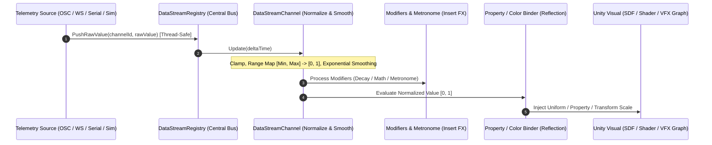

# Signal Routing Architecture & Data Pipeline

The **Signal Routing Architecture** in PulseEngine functions as a real-time, zero-latency digital patchbay for continuous and discrete telemetry. It decouples high-frequency data ingestion protocols (OSC, WebSockets, Serial COM, Simulators) from the Unity rendering pipeline, providing normalized, smoothed, and thread-safe data streams to visual components.

---

## High-Level Data Flow



---

## 1. Central Bus: `DataStreamRegistry`

The `DataStreamRegistry` is the single source of truth for all active telemetry streams in the scene. It operates as a high-performance singleton accessible via `DataStreamRegistry.Instance`.

### Architectural Guarantees
* **Thread Safety**: Network sources receiving UDP packets or WebSocket frames in background threads call `PushRawValue()` safely without blocking the Unity player loop.
* **Zero Runtime GC Allocations**: In steady state, the registry loops directly over pre-allocated channel lists. No temporary heap objects, dictionaries, or linq enumerators are created per frame ($0\text{ Bytes/frame}$).
* **Dynamic Auto-Discovery (Traffic Sniffer)**: The registry inspects inbound packet addresses in real-time. Unmapped keys are logged with packet frequency and observed $[Min, Max]$ bounds, allowing instant channel generation directly from the DAW Mixer.

---

## 2. Channel Normalization & Smoothing: `DataStreamChannel`

Every telemetry stream is encapsulated in a `DataStreamChannel` object. Because raw sensors output widely differing physical units (e.g., Heart Rate in $30\text{--}200\text{ BPM}$, Blood Oxygenation in $70\text{--}100\%$, Accelerometers in $\text{m/s}^2$), PulseEngine standardizes all data into a **unitless $[0, 1]$ normalized space**.

### Mathematical Formulation

#### 1. Linear Range Mapping
Given raw input $x$, input minimum $x_{\min}$, and input maximum $x_{\max}$:
$$x_{\text{clamped}} = \text{clamp}(x, x_{\min}, x_{\max})$$
$$x_{\text{norm}} = \frac{x_{\text{clamped}} - x_{\min}}{x_{\max} - x_{\min}}$$

#### 2. Temporal Smoothing (Exponential Moving Average)
To eliminate sensor noise and high-frequency discretization artifacts:
$$y_t = y_{t-1} + (x_{\text{norm}} - y_{t-1}) \cdot \left(1 - e^{-\frac{\Delta t}{\tau}}\right)$$
where $\tau$ is the smoothing time constant configurable in the DAW Mixer fader strip.

---

## 3. Property Reference Table

### `DataStreamChannel` Properties

| Property | Type | Default | Description |
| :--- | :--- | :--- | :--- |
| **`channelId`** | `string` | `""` | Unique string identifier for the channel (e.g., `"heart_rate"`, `"spo2"`). |
| **`displayName`** | `string` | `""` | Human-readable label displayed on the DAW Mixer console strip. |
| **`minInputValue`** | `float` | `0.0` | Lower bound of expected raw input data. Mapped to $0.0$. |
| **`maxInputValue`** | `float` | `1.0` | Upper bound of expected raw input data. Mapped to $1.0$. |
| **`smoothTime`** | `float` | `0.1` | Time constant for exponential smoothing. Set to `0.0` for raw pass-through. |
| **`isMuted`** | `bool` | `false` | When true, output is forced to restful baseline ($0.0$) without closing data streams. |
| **`isSoloed`** | `bool` | `false` | When true, only soloed channels broadcast output; all others are muted. |

---

## 4. Scripting API Example

Registering and querying channels programmatically via C#:

```csharp
using UnityEngine;
using PulseEngine;

public class CustomTelemetryReceiver : MonoBehaviour
{
    private void Start()
    {
        // 1. Ensure the channel is provisioned in the central registry
        var registry = DataStreamRegistry.Instance;
        if (!registry.HasChannel("engine_rpm"))
        {
            var rpmChannel = new DataStreamChannel("engine_rpm", min: 0f, max: 8000f, smooth: 0.15f);
            registry.RegisterChannel(rpmChannel);
        }
    }

    private void OnNetworkPacketReceived(float incomingRpm)
    {
        // 2. Thread-safe push of raw data
        DataStreamRegistry.Instance.PushRawValue("engine_rpm", incomingRpm);
    }

    private void Update()
    {
        // 3. Read the normalized [0, 1] smoothed value for custom logic
        float normalizedRpm = DataStreamRegistry.Instance.GetNormalizedValue("engine_rpm");
        
        // 4. Read the raw physical value
        float currentRpm = DataStreamRegistry.Instance.GetRawValue("engine_rpm");
    }
}
```

---

## 5. Best Practices & Optimization

> [!TIP]
> **Use Normalized Values in Shaders**: Always feed the normalized $[0, 1]$ value into materials and shaders. Let the individual `DataStreamPropertyBinder` remap that range locally to custom graphical bounds (e.g., scale $[0.5, 2.0]$ or turbulence $[0.1, 0.4]$). This decouples your visual design from sensor hardware specs.

> [!NOTE]
> **Domain Reload & Scene Transitions**: `DataStreamRegistry` is decoupled from scene lifecycles and automatically clears channel cache dictionaries on domain reloads to prevent dangling references in the Unity Editor.
