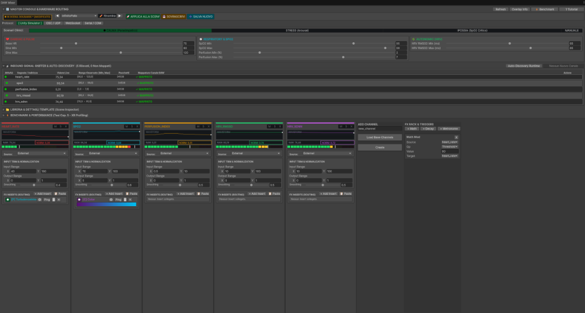
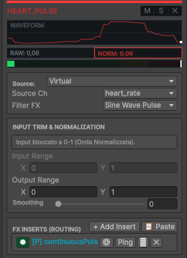

# DAW Mixer Console Manual

The **DAW Mixer Console** (`DAWMixerWindow`) is the operator command center for PulseEngine. Designed after professional digital audio workstations (Ableton Live, Pro Tools, Logic Pro), it provides real-time channel strip monitoring, fader control, hardware oscilloscopes, and virtual patching within a single docked editor window.

---

## Accessing the DAW Mixer

Open the console via the Unity Editor menu:
```text
Window > PulseEngine > DAW Mixer
```

---

## Console Overview
<p align="center">
  
</p>

The DAW Mixer console is divided into five specialized zones:
1. **Master Console & Hardware Routing**: Top bar with Preset snapshot manager, Protocol selection, and quick links.
2. **Clinical Simulator Scenario Bar**: Real-time sliders for simulated cardiac rate, SpO2, and autonomic HRV.
3. **Inbound Signal Sniffer & Auto-Discovery Matrix**: Live telemetry traffic table with activity LEDs, observed bounds $[Min, Max]$, and auto-provision buttons.
4. **Vertical Channel Strips**: Individual channel strips with oscilloscopes, trim normalization, smoothing, and amplitude faders.
5. **FX Inserts & Trigger Rack**: Math modifiers, metronome anti-jitter conditioning, and reflection output binders.

---

## Channel Strip Architecture

<p align="center">
  
</p>

Each telemetry channel in the mixer possesses a dedicated vertical strip providing complete control over normalization, filtering, and destination mapping:

Located at the top of the window, this bar remains pinned regardless of vertical scrolling:

* **OLED State Indicator**: Displays the currently active scene preset. If parameters have been modified from the saved asset, an asterisk `* [MODIFICATO]` appears.
* **Preset Navigation `[◀] [▶]`**: Cycles through all detected `SdfSceneTemplate` ScriptableObjects in the project.
* **`[+ Nuovo]`**: Opens a prompt to instantiate a new clean preset asset in `Assets/.../Templates/`.
* **`[💾 Salva] / [SOVRASCRIVI]`**: Serializes all active channel configurations, normalizers, faders, SDF nodes, and texturing options into the asset with 1 click.

---

## 2. Inbound Signal Sniffer & Auto-Discovery

The **Inbound Signal Sniffer** listens to the network socket layer in real-time, detecting every key received regardless of whether a channel has been manually defined.

### Features
* **Live Activity LEDs**: Flashes green when packets are actively arriving on that address.
* **Status Badges**:
  * **`MAPPED`** (Green): Channel is already active in the mixer.
  * **`UNMAPPED`** (Yellow): Raw data is arriving, but no channel strip currently processes it.
* **`[+ Crea]` Inline Button**: Instantly provisions a channel for that specific key with calibrated minimum and maximum bounds derived from observed incoming values.
* **`[⚡ Auto-Crea Canali Rilevati]`**: Provisions all discovered unmapped signals in a single operation.
* **`[✔ Auto-Discovery Runtime]` Toggle**: Automatically provisions any new unexpected telemetry stream as soon as it touches the port.

---

## 3. Channel Strip Architecture

Each channel in the mixer possesses a dedicated vertical strip:

### Real-Time OLED Oscilloscope
Renders a continuous rolling waveform (50 samples) of the incoming signal. The trace is automatically color-coded:
* **Cyan**: Normal continuous signal.
* **Red / Warning**: Clamped signal exceeding $[Min, Max]$ bounds.
* **Dimmed / Gray**: Silenced (Muted).

### Calibration Sliders ($[Min, Max]$)
Adjust the input boundaries used to calculate the $[0, 1]$ normal. Values outside this range are safely clamped.

### Smoothing Slider (`Smooth`)
Configures the exponential time constant $\tau$. Drag to the right for silky, stabilized motion; drag to zero for instantaneous raw responsiveness.

### Amplitude Fader
Scales the output amplitude $[0, 1] \times \text{Fader}$. Double-click the thumb to reset to unity gain ($1.0$).

### Hardware-Style Mute `[M]` & Solo `[S]`
* **Mute `[M]`**: Silences the channel. Rather than freezing, all connected `DataStreamPropertyBinder` instances immediately interpolate toward their configured **Rest Value** (e.g., resting scale or neutral color).
* **Solo `[S]`**: Silences all channels in the mixer except those with Solo active.

---

## 4. Virtual Patching: Output Binders

At the bottom of each strip is the **Binders** foldout:
* Click **`[+ Attach Property Binder]`** to wire the channel to any GameObject, Component, VisualEffect, or Renderer.
* The system utilizes **Reflection** to inspect the target object and populate dropdowns with all available `float`, `Color`, and `Vector4` parameters.
* **Use Local Remap**: Remaps the normalized $[0, 1]$ signal to customized target units (e.g., $0.0 \to 1.0$ becomes $45^\circ \to 90^\circ$ rotation, or $0.08 \to 0.35$ turbulence).

---

## 5. Performance Benchmarking Panel

Click the **`[⚡ BENCHMARK]`** toolbar button to expose the integrated profiling suite:
* **One-Click Run**: Executes the automated 13-stage `MedicalXRBenchmarkRunner` suite.
* **Progress Bar**: Shows active warmup and measurement phases.
* **Results Table**: Displays Avg FPS, 1% Lows, Frame Time, and VRAM bandwidth.
* **Export Links**: Single-click buttons to open generated `Benchmark_Results.md` or raw `benchmark_data.csv` files.
