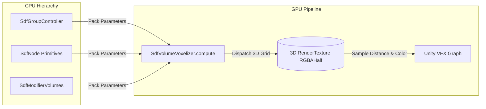
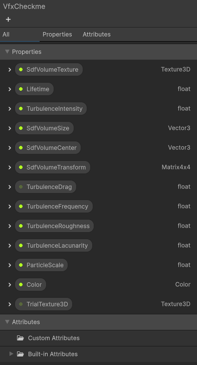
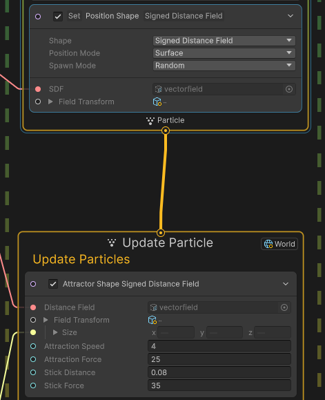
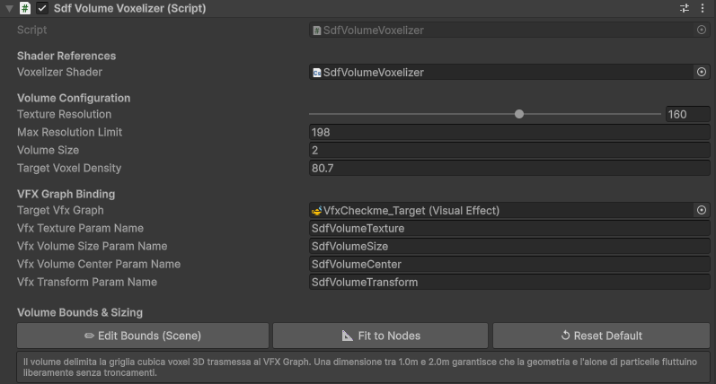

# GPU Voxelizer & VFX Graph Pipeline

The **GPU Voxelizer** (`SdfVolumeVoxelizer`) is the bridge between PulseEngine's mathematical Signed Distance Fields and **Unity Visual Effect Graph (VFX Graph)**. It compiles dynamic CSG operations and modifier warps into a real-time **3D RenderTexture**, allowing massive particle systems (hundreds of thousands of particles) to conform, collide, and flow across procedural volumes at high framerates.

---

## 1. System Pipeline Overview

  
   <em>VFX Graph particles conforming and advecting dynamically over real-time CSG distance volume.</em>

1. **Parameter Packing**: On every frame, `SdfVolumeVoxelizer.cs` serializes active transforms, CSG modes, and blend values into structured GPU constant buffers (`_NodeParams`, `_NodeColors`, `_NodeMatrices`).
2. **Compute Dispatch**: `SdfVolumeVoxelizer.compute` executes a 3D thread group grid ($8 \times 8 \times 8$ threads per group) over the target resolution (typically $32^3$, $64^3$, or $128^3$).
3. **Texture Generation**: Every voxel evaluates the complete CSG field and writes an `RGBAHalf` float value:
   * **Red (R)**: Signed distance value in normalized metric units (used by VFX Graph for collision, attraction, and killing particles outside the shape).
   * **Green, Blue, Alpha (GBA)**: Interpolated RGB surface color of the closest primitive.
4. **VFX Sampling**: VFX Graph samples the 3D texture via trilinear filtering.

---

## 2. Metric Normalization & Scaling Alignment

### The Double-Scaling Challenge
In Unity VFX Graph, the native `Sample SDF` block automatically multiplies sampled distance by the volume transform scale (`FieldTransform.size`). If the compute shader wrote distances directly in raw world meters, VFX Graph would scale the distance a second time, resulting in blurred, swollen boundaries and loose particle adhesion.

### The PulseEngine Solution
`SdfVolumeVoxelizer.compute` normalizes output distances by the volume bounding dimension before writing to `Result[id]`:
$$\text{Result.r} = \frac{d_{\text{world}}}{\max(\text{VolumeSize})}$$
In VFX Graph, connecting `SdfVolumeSize` directly to the `FieldTransform.size` pin creates an **exact 1:1 metric correspondence**: particles stick with surgical precision to the surface boundary ($d = 0.0$) regardless of volume scaling ($1.0\text{ m} \to 3.0\text{ m}$).

---

## 3. Configuring VFX Graph Blocks

  
  
   <em>Left: Exposed Blackboard parameters. Right: Set Position Shape (SDF Surface) and Attractor Shape (Stick Distance 0.08m, Attraction Force 25, Stick Force 35).</em>

To bind a VFX Graph to PulseEngine's dynamic volume:

### 1. Spawn Context: `Position (Signed Distance Field)`
* **SDF**: Expose a Blackboard `Texture3D` property (`SdfVolumeTexture`) and assign the rendered volume.
* **Field Transform**: Assign the `Transform` of the `SDF_Volume` GameObject.
* **Field Size**: Bind `SdfVolumeSize`.

### 2. Update Context: `Attractor Shape Signed Distance Field` (or `Conform to SDF`)
* **Distance Field**: Connect `SdfVolumeTexture`.
* **Field Transform**: Connect `SdfVolumeTransform`.
* **Stick Distance**: Set to `0.08` ($8\text{ cm}$).
* **Attraction Speed**: `4.0`.
* **Attraction Force**: `25.0`.
* **Stick Force**: `35.0`.
* With these tuned parameters, particles resist high turbulence and adhere firmly to complex organic folds without jittering.

---

## 4. Physics-Only Mode (Fill-Rate Decoupling)

Raymarching solid surfaces involves calculating ray steps for every pixel on the screen. On high-resolution stereoscopic mobile headsets like **Meta Quest 3** ($2064 \times 2208$ pixels per eye at $90\text{ Hz}$), full-screen solid raymarching can saturate GPU fragment fill-rate.

### How Physics-Only Mode Works:
* Toggle **`renderSolidMesh = false`** on `SdfVolumeVoxelizer`.
* The `MeshRenderer` of the proxy mesh is disabled, completely eliminating the solid fragment raymarching pass.
* The GPU compute shader continues to voxelize the 3D texture ($< 0.8\text{ ms}$ on mobile).
* VFX Graph renders particles colliding with the invisible mathematical volume.

> [!TIP]
> **Performance Impact**: Profiling on Quest 3 proves that *Physics-Only Mode* delivers a **$61.3\%$ reduction in GPU frame time** (from $7.84\text{ ms}$ down to $3.03\text{ ms}$), providing rock-solid $90\text{ Hz}$ performance with zero dropped frames.

---

## 5. Inspector Reference: `SdfVolumeVoxelizer`

  

| Property | Type | Default | Description |
| :--- | :--- | :--- | :--- |
| **`volumeSize`** | `float` | `1.2` | Cubic isotropic bounding dimension of the voxel grid in meters. |
| **`textureResolution`**| `Enum` | `Resolution_64`| 3D texture resolution: `16`, `32`, `48`, `64`, `96`, `128`, `192`, `256`. |
| **`renderSolidMesh`** | `bool` | `true` | Toggle between Full Solid Raymarch and Physics-Only Mode. |
| **`targetVfxGraph`** | `VisualEffect`| `null`| Target VFX Graph component receiving the 3D texture property. |
| **`vfxTextureProperty`**| `string`| `"SDF_Texture"`| Blackboard property name in the VFX Graph. |
