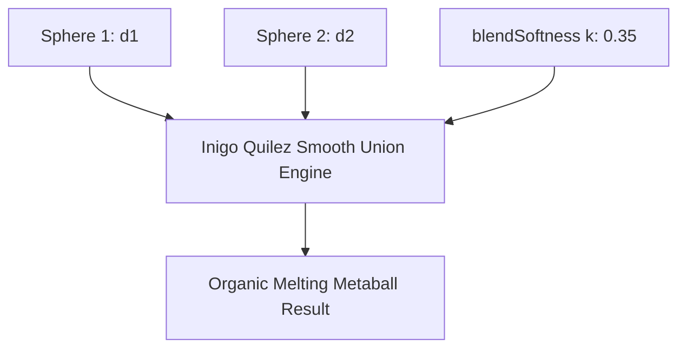

# SDF Primitives & CSG Operations

The **Volumetric Engine** in PulseEngine renders solid procedural geometry using **Signed Distance Fields (SDFs)** evaluated via real-time raymarching in the Universal Render Pipeline (URP). Unlike traditional polygonal meshes made of triangles, SDFs evaluate continuous mathematical functions directly on the GPU, providing infinite resolution, smooth organic blending, and zero topology distortion.

---

## 1. What is a Signed Distance Field?

A Signed Distance Function defines the shortest Euclidean distance from any point $\mathbf{p} \in \mathbb{R}^3$ in 3D space to the boundary of a geometric surface:

$$f(\mathbf{p}) = \begin{cases} 
< 0 & \text{inside the surface} \\
= 0 & \text{on the boundary surface} \\
> 0 & \text{outside the surface}
\end{cases}$$

Surfaces are rendered using **Sphere Tracing** (Raymarching): a ray is marched from the camera into the scene, stepping forward along the view direction by the distance $d = f(\mathbf{p})$ returned by the SDF, until it intersects the boundary ($d < \epsilon$).

---

## 2. Supported Mathematical Primitives

PulseEngine evaluates five analytic primitives and one sampled volumetric primitive:

| Primitive | Mathematical Formula $f(\mathbf{p})$ | Description |
| :--- | :--- | :--- |
| **Sphere** | $\|\mathbf{p}\| - r$ | Perfect sphere centered at the local origin with radius $r$. |
| **Box** | $\|\max(|\mathbf{p}| - \mathbf{b}, 0)\| + \min(\max(p_x - b_x, p_y - b_y, p_z - b_z), 0)$ | 3D oriented bounding box with half-extents $\mathbf{b}$. |
| **Torus** | $\|( \|\mathbf{p}_{xz}\| - R, p_y )\| - r$ | Ring donut with major radius $R$ and cross-section radius $r$. |
| **Cylinder** | $\max(\|\mathbf{p}_{xz}\| - r, |p_y| - h)$ | Finite cylinder with radius $r$ and half-height $h$. |
| **Capsule** | $\|\mathbf{p} - \mathbf{b} \cdot \text{clamp}\left(\frac{\mathbf{p} \cdot \mathbf{b}}{\mathbf{b} \cdot \mathbf{b}}, 0, 1\right)\| - r$ | Line segment capped with hemispherical ends. |
| **Baked Texture3D**| $\text{Sample}(\text{Texture3D}, \mathbf{uvw}) \cdot \text{Scale}$ | Volumetric scan (e.g., DICOM medical organ, CT/MRI, baked shape). |

---

## 3. Constructive Solid Geometry (CSG) & Smooth Blending

Multiple `SdfNode` components combine constructively to form complex organisms or mechanisms.

### Boolean Operations (Sharp CSG)
* **Union**: $d = \min(d_1, d_2)$
* **Subtraction**: $d = \max(d_1, -d_2)$
* **Intersection**: $d = \max(d_1, d_2)$

### Polynomial Smooth Blending (Inigo Quilez Formulation)
Sharp boolean cuts look rigid and mechanical. PulseEngine incorporates smooth polynomial blending to simulate visceral, melting, and organic fusions:

#### Smooth Union
$$h = \text{clamp}\left(0.5 + 0.5 \cdot \frac{d_2 - d_1}{k}, 0.0, 1.0\right)$$
$$\text{SmoothUnion}(d_1, d_2, k) = \text{lerp}(d_2, d_1, h) - k \cdot h \cdot (1.0 - h)$$
where $k$ is the `blendSoftness` parameter.

#### Smooth Subtraction
$$h = \text{clamp}\left(0.5 - 0.5 \cdot \frac{d_1 + d_2}{k}, 0.0, 1.0\right)$$
$$\text{SmoothSub}(d_1, d_2, k) = \text{lerp}(d_1, -d_2, h) + k \cdot h \cdot (1.0 - h)$$

#### Smooth Intersection
$$h = \text{clamp}\left(0.5 - 0.5 \cdot \frac{d_1 - d_2}{k}, 0.0, 1.0\right)$$
$$\text{SmoothInt}(d_1, d_2, k) = \text{lerp}(d_1, d_2, h) + k \cdot h \cdot (1.0 - h)$$

---

## 4. Inspector Reference: `SdfNode`

Each primitive in the scene is governed by an `SdfNode` component:

| Property | Type | Default | Description |
| :--- | :--- | :--- | :--- |
| **`shapeType`** | `Enum` | `Sphere` | Primitive geometry: `Sphere`, `Box`, `Torus`, `Cylinder`, `Capsule`, `BakedTexture3D`. |
| **`combineOp`** | `Enum` | `SmoothUnion` | Interaction with preceding nodes: `Union`, `Subtraction`, `Intersection`, `SmoothUnion`, `SmoothSubtraction`, `SmoothIntersection`. |
| **`blendSoftness`** | `float` | `0.0` | Softness radius $k$ in meters. Set to $0.0$ for sharp mechanical cuts. |
| **`shapeRadius`** | `float` | `0.5` | Radius for spheres, cylinders, and tori. |
| **`shapeSize`** | `Vector3` | `(0.5, 0.5, 0.5)`| Half-extents for boxes and 3D textures. |
| **`nodeColor`** | `Color` | `White` | Base color interpolated during smooth CSG operations. |
| **`bakedTexture`** | `Texture3D`| `null` | Volumetric asset reference if using `BakedTexture3D` mode. |

---

## 5. Hierarchy & Evaluation Order

In PulseEngine, nodes evaluate **Top-to-Bottom based on Unity's Sibling Index**:
1. The topmost child of `SdfGroupController` initializes the distance field.
2. Each subsequent child modifies the accumulated distance using its chosen `combineOp`.
3. To change evaluation priority, simply re-order nodes in the Unity Hierarchy window.
