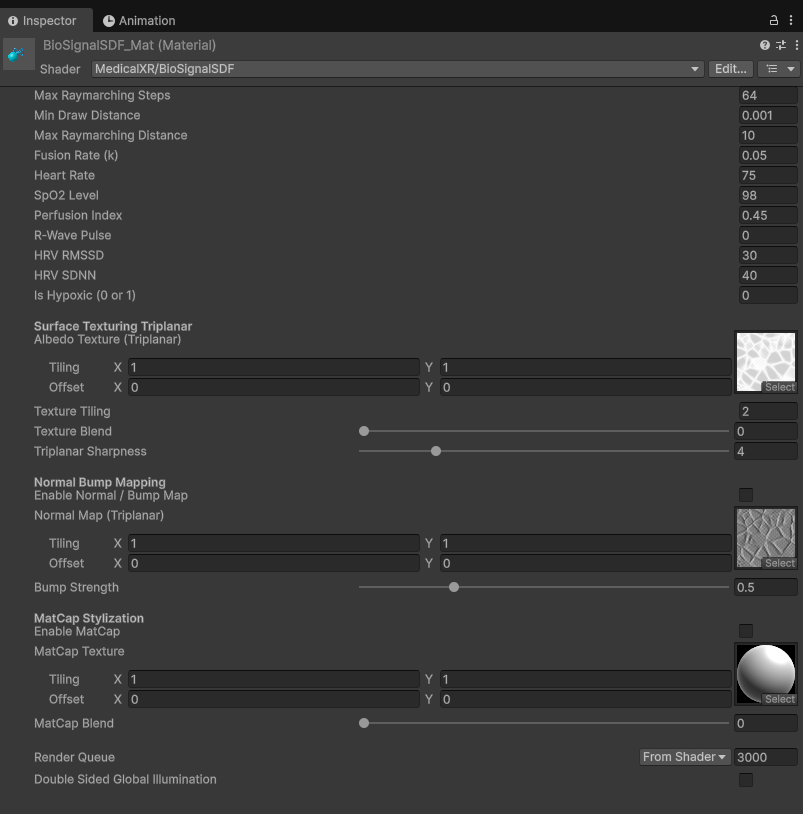

# Surface Texturing & MatCaps (Implicit Shading)

Because Signed Distance Fields are defined mathematically in continuous 3D space rather than as discretized polygon meshes, they **do not possess traditional UV texture coordinates**. 

PulseEngine incorporates an advanced implicit texturing pipeline featuring **Object-Space Triplanar Projection**, **Morten Mikkelsen Surface Gradients**, and **View-Space MatCaps** to render organic cellular tissue, bone structures, and biological membranes without texture seams or stretching.

---

## 1. Object-Space Triplanar Projection

Triplanar mapping samples 2D textures along the three principal Cartesian axes ($X, Y, Z$) and blends them based on the surface normal $\mathbf{N}$:

```mermaid
graph TD
    P[Surface Point p in Object Space] --> ProjX[Sample (py, pz) along X]
    P --> ProjY[Sample (px, pz) along Y]
    P --> ProjZ[Sample (px, py) along Z]
    N[Surface Normal N] --> Weights[Calculate Exponential Normalized Weights wX, wY, wZ]
    ProjX --> Blend[Weighted Accumulation: wX*TexX + wY*TexY + wZ*TexZ]
    ProjY --> Blend
    ProjZ --> Blend
    Weights --> Blend
    Blend --> FinalColor[Seamless Implicit Surface Color]
```

### Exponential Weight Normalization
Conventional triplanar blending using linear weights produces washed-out diagonal transitions. PulseEngine utilizes exponential blending with a threshold:
$$w_i = \max(0.0, |N_i| - 0.2)^4, \quad i \in \{x, y, z\}$$
$$\hat{w}_i = \frac{w_i}{w_x + w_y + w_z}$$
This ensures sharp, crisp texture projection on amorphous, dynamically deforming geometry.

---

## 2. Morten Mikkelsen Surface Gradient (Seamless Normal Perturbation)

### The Seam Problem in Standard Triplanar Normals
Conventional triplanar normal mapping utilizes sign-based plane flips ($\text{sign}(N_x)$). On implicit raymarched surfaces, this produces severe $180^\circ$ normal flips and glaring discontinuous seams across the Cartesian symmetry planes ($X = 0$, $Y = 0$, $Z = 0$).

### The Surface Gradient Formulation
PulseEngine implements the **Morten Mikkelsen Surface Gradient** framework (standardized in high-end game engines and Blender). The surface gradient $\nabla_{\text{surf}} h$ represents the change of height $h$ strictly tangent to the implicit surface:

$$\nabla_{\text{surf}} h = \nabla h - (\mathbf{N} \cdot \nabla h) \mathbf{N}$$
$$\mathbf{N}' = \text{normalize}\left(\mathbf{N} - \text{bumpStrength} \cdot \nabla_{\text{surf}} h\right)$$

Because the surface gradient is inherently tangent to the geometric normal $\mathbf{N}$, it produces **$C^1$ continuous normal maps with zero symmetry seams**, providing smooth micro-relief across dynamically morphing metaballs.

---

## 3. View-Space MatCap Shading
<p align="center">
  
  <br><em>BioSignalSDF material inspector displaying raymarching steps, triplanar albedo tiling, Mikkelsen bump strength, and view-space MatCap blending.</em>
</p>

For stylized medical illustrations and clinical diagnostics, PulseEngine supports **Material Capture (MatCap)** shading.

MatCaps sample a spherical reference texture using the view-space surface normal:
$$\mathbf{u}_{\text{matcap}} = \mathbf{N}_{\text{view}} \cdot 0.5 + 0.5$$

PulseEngine ships with four medical-grade MatCap and procedural textures in `Runtime/VolumetricSDF/Textures/`:
* **`Medical_Bone_MatCap.png`**: Rigid, calcified cortical bone shading with smooth specular falloff.
* **`Medical_Flesh_MatCap.png`**: Warm, semi-translucent visceral muscle and vascular tissue.
* **`Organic_Cellular_Albedo.png`**: Seamless microscopic cellular tissue pattern.
* **`Organic_Cellular_Normal.png`**: High-frequency micro-organic cellular relief.

---

## 4. Universal Render Pipeline (URP) Dynamic Lighting

`BioSignalSDF.shader` connects directly into URP's lighting pipeline:
* Calls `GetMainLight()` to fetch the scene's primary directional sun light.
* Transforms world-space light direction into local object space:
  $$\mathbf{L}_{\text{local}} = \text{TransformWorldToObjectDir}(\text{mainLight.direction})$$
* Evaluates Blinn-Phong specular highlights and Half-Lambert diffuse shading.
* The implicit geometry reacts in real time to the rotation, color, and intensity of Unity's scene lighting.
