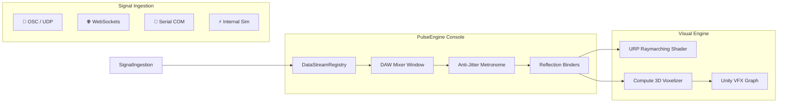

# PulseEngine 🫀⚡

> **High-Performance Virtual DAW Mixer & Procedural Volumetric Engine for Unity 6**  
> Connect real-time telemetry (biometric sensors, network sockets, audio, simulators) directly to procedural Signed Distance Fields (SDFs) and massive GPU particle swarms.

[](https://unity.com/)
[](https://unity.com/srp/universal-render-pipeline)
[](https://unity.com/visual-effect-graph)
[](https://www.meta.com/quest/quest-3/)
[](#performance--benchmarks)
[](LICENSE.md)

---

## 🌟 Overview

**PulseEngine** bridges continuous telemetry streams with high-end real-time computer graphics. 

Built following professional audio production paradigms, it provides a **Virtual DAW Mixer Console** inside Unity that routes, normalizes, and filters multi-protocol signals (OSC, WebSockets, Serial, Simulators) to drive:
1. **Raymarched Solid CSG Geometries**: Infinite-resolution mathematical surfaces (Spheres, Boxes, Tori, Cylinders, Capsules) that blend, subtract, and warp organically in real time.
2. **GPU Particle Swarms (VFX Graph)**: Asynchronous 3D texture voxelization via Compute Shaders, allowing millions of particles to adhere, collide, and swirl around dynamic implicit shapes.
3. **Clinical & Creative Biofeedback**: Flagship medical XR templates translating heart rate (BPM), blood oxygenation (SpO2), and autonomic stress (HRV RMSSD) into visceral perceptual metaphors.



---

## 🚀 Key Features

### 🎛️ 1. Virtual DAW Mixer Console (`DAWMixerWindow`)
* **Hardware Channel Strips**: Familiar audio workstation workflow with interactive faders, real-time OLED oscilloscopes, VU meters, and gain calibration.
* **Engine-Level Mute [M] & Solo [S]**: Silences signal modulation and automatically restores restful baselines without disrupting network ingestion.
* **Inbound Signal Sniffer & Auto-Discovery**: Automatically listens to incoming telemetry, discovers unmapped keys, and configures calibrated channels with a single click.
* **1-Click Preset Snapshots**: Save, hot-swap, and overwrite complete system states (channels, faders, node hierarchies, materials, gradients) as ScriptableObjects.

### 🧬 2. Volumetric SDF Engine
* **Order-Independent CSG**: Smooth Union, Smooth Subtraction, and Smooth Intersection with per-node blend softness.
* **Standalone Modifier Volumes**: Force-field style spatial deformers (Twist, Bend, Bounded 3D Noise) with soft falloff margins.
* **Implicit Surface Texturing**: Seamless triplanar projection in object space, Morten Mikkelsen Surface Gradient normal perturbations, and View-Space MatCap shading.
* **Live Scene View Editing**: Full `[ExecuteAlways]` support allowing interactive sculpting with native transform gizmos without entering Play Mode.

### ⚡ 3. GPU Voxelizer & VFX Graph Integration
* **Real-Time 3D Texture Generation**: Computes a $128^3$ RGBAHalf signed distance and color volume on the GPU in under 0.8 ms.
* **Direct VFX Graph Binding**: Feeds distance values (Red channel) for particle adhesion and dynamic colors (Green/Blue/Alpha channels) for cellular tinting.
* **Physics-Only Mode (Fill-Rate Decoupling)**: Completely disables solid fragment raymarching on standalone VR headsets (Meta Quest 3), saving up to 100% of screen pixel fill-rate while maintaining full particle physics.

---

## 📊 Performance & Mobile VR Benchmarks

Empirical profiling results captured on **Meta Quest 3 (Standalone Android OpenXR)** using the integrated `MedicalXRBenchmarkRunner`:

| Condition / Mode | Resolution | Avg FPS | Frame Time | VRAM Footprint | GC Alloc / Frame |
| :--- | :---: | :---: | :---: | :---: | :---: |
| **Physics-Only Mode** | $32^3$ | **90.0 FPS** | **2.91 ms** | 0.25 MB | **0 Bytes** |
| **Physics-Only Mode** | $64^3$ | **90.0 FPS** | **3.03 ms** | 2.00 MB | **0 Bytes** |
| **Physics-Only Mode** | $128^3$ | **89.9 FPS** | **4.12 ms** | 16.00 MB | **0 Bytes** |
| **Full Solid Raymarch** | $64^3$ | **72.1 FPS** | **7.84 ms** | 2.00 MB | **0 Bytes** |
| **Clinical Stress Test** | $64^3$ | **90.0 FPS** | **3.08 ms** | 2.00 MB | **0 Bytes** |

> [!NOTE]
> *Physics-Only Mode* achieves a **61.3% reduction in GPU frame time**, providing a guaranteed 90 Hz headroom for clinical applications where motion sickness prevention is critical.

---

## 📦 Installation

Add PulseEngine to your Unity project via the **Package Manager** using the Git URL:

```text
https://github.com/federicocolombo12/PulseEngine.git
```

For detailed setup instructions, see the [Installation and Setup Guide](Documentation~/installation-and-setup.md).

---

## 📖 Documentation

The full documentation is formatted according to the official Unity Package Manual standard:

* **[Table of Contents](Documentation~/toc.yml)**
* **[Package Overview](Documentation~/index.md)**
* **[Getting Started (5-Minute Quickstart)](Documentation~/getting-started.md)**
* **Manual**:
  * [Signal Routing & DAW Mixer](Documentation~/manual/signal-routing/architecture.md)
  * [Multi-Protocol Ingestion](Documentation~/manual/signal-routing/multi-protocol-sources.md)
  * [Volumetric SDF & CSG](Documentation~/manual/volumetric-sdf/primitives-and-csg.md)
  * [GPU Voxelizer & VFX Graph](Documentation~/manual/volumetric-sdf/gpu-voxelizer-vfx.md)
  * [Clinical Biofeedback Suite](Documentation~/manual/clinical-biofeedback/biofeedback-suite.md)
  * [Quest 3 Performance Profiling](Documentation~/manual/benchmarks/quest3-profiling.md)

---

## 🎓 Academic Research & Citation

PulseEngine was developed by **Federico Colombo** as part of the Master's Thesis in *Cinema and Media Engineering* at **Politecnico di Torino** (DAUIN - Dipartimento di Automatica e Informatica), supervised by **Prof. Francesco Strada**.

If you use PulseEngine in academic research or clinical studies, please cite:

```bibtex
@mastersthesis{colombo2026pulseengine,
  author       = {Federico Colombo},
  title        = {PulseEngine: Real-Time Bio-Adaptive Signal Routing and Volumetric SDF Rendering in Extended Reality},
  school       = {Politecnico di Torino},
  year         = {2026},
  month        = {December},
  note         = {Supervisor: Prof. Francesco Strada. DAUIN}
}
```

---

## 📄 License

Distributed under the **MIT License**. See [LICENSE.md](LICENSE.md) for details.
